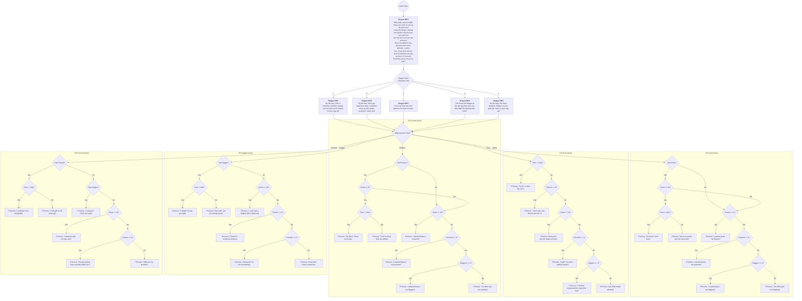

```mermaid
graph TD
    %% --- START OF GAME ---
    Start((Game Start)) --> DragonIntro["<b>Dragon NPC</b><br/>'Why hello, brave Knight! Have you come to rescue the princess?<br/>I hear the King is offering her hand to anyone who can save her!<br/>Ha! Any fool can save the princess!<br/>Now, I've talked to the princess and we've devised... a plan.<br/>Yes. If you don't win her heart by the time you get up there, I'll eat you!<br/>I'll tell her you're on you're way!'"]
    DragonIntro --> RandomQuest{Dragon Picks<br/>a Random Hint}

    %% --- THE HINTS ---
    RandomQuest -->|1| HintF["<b>Dragon NPC</b><br/>'By the way, she's a hopeless romantic. Maybe you can pick some flowers on your way up!'"]
    RandomQuest -->|2| HintG["<b>Dragon NPC</b><br/>'By the way, she’s got expensive taste. I wouldn't show up with empty pockets if I were you!'"]
    RandomQuest -->|3| HintT["<b>Dragon NPC</b><br/>'Hurry up! She has zero patience for slow rescues.'"]
    RandomQuest -->|4| HintD["<b>Dragon NPC</b><br/>'She threw her dagger at the last guy that came up. She might be wanting that back!'"]
    RandomQuest -->|5| HintP["<b>Dragon NPC</b><br/>'By the way, she loves surpises. Maybe you can grab her a gift on your way up!'"]

    %% --- CONNECT TO SUBGRAPHS ---
    HintF --> GoalCheck
    HintG --> GoalCheck
    HintT --> GoalCheck
    HintD --> GoalCheck
    HintP --> GoalCheck

    GoalCheck{What was the Goal?}

    %% --- FLOWER QUEST ---
    subgraph Flower_Quest [The Flower Quest]
        GoalCheck -->|Flowers| F_Has{Has Flowers?}
        F_Has -->|No| F_G_Check{Gems >= 10?}
        F_Has -->|Yes| F_Count{Count >= 8?}
        
        F_Count -->|Yes| F_Time{Time < 120s?}
        F_Count -->|No| F_G_Check
        
        F_Time -->|Yes| F_Win["Princess: 'My Hero! These are lovely.'"]
        F_Time -->|No| F_Slow["Princess: 'Took too long, they are wilting!'"]
        
        F_G_Check -->|Yes| F_Fail_G["Princess: 'I wanted flowers, not gems!'"]
        F_G_Check -->|No| F_P_Check{Presents >= 1?}
        
        F_P_Check -->|Yes| F_Fail_P["Princess: 'I wanted flowers, not presents!'"]
        F_P_Check -->|No| F_D_Check{Daggers >= 1?}
        
        F_D_Check -->|Yes| F_Fail_D["Princess: 'I wanted flowers, not daggers!'"]
        F_D_Check -->|No| F_Empty["Princess: 'You didn't get me anything!'"]
    end

    %% --- GEM QUEST ---
    subgraph Gem_Quest [The Gem Quest]
        GoalCheck -->|Gems| G_Has{Has Gems?}
        G_Has -->|No| G_F_Check{Flowers >= 8?}
        G_Has -->|Yes| G_Count{Count >= 10?}
        
        G_Count -->|Yes| G_Time{Time < 120s?}
        G_Count -->|No| G_F_Check
        
        G_Time -->|Yes| G_Win["Princess: 'So shiny! I love them.'"]
        G_Time -->|No| G_Slow["Princess: 'Gems are great, but you were slow.'"]
        
        G_F_Check -->|Yes| G_Fail_F["Princess: 'I wanted gems, not flowers!'"]
        G_F_Check -->|No| G_P_Check{Presents >= 1?}
        
        G_P_Check -->|Yes| G_Fail_P["Princess: 'I wanted gems, not presents!'"]
        G_P_Check -->|No| G_D_Check{Daggers >= 1?}
        
        G_D_Check -->|Yes| G_Fail_D["Princess: 'I wanted gems, not daggers!'"]
        G_D_Check -->|No| G_Empty["Princess: 'You didn't get me anything!'"]
    end

    %% --- TIME QUEST ---
    subgraph Time_Quest [The Time Quest]
        GoalCheck -->|Time| T_Time{Time < 120s?}
        T_Time -->|Yes| T_Win["Princess: 'You're so fast! My hero!'"]
        T_Time -->|No| T_F_Check{Flowers >= 8?}
        
        T_F_Check -->|Yes| T_Fail_F["Princess: 'You're late, and flowers don't fix it!'"]
        T_F_Check -->|No| T_G_Check{Gems >= 10?}
        
        T_G_Check -->|Yes| T_Fail_G["Princess: 'Being rich doesn't make you fast!'"]
        T_G_Check -->|No| T_P_Check{Presents >= 1?}
        
        T_P_Check -->|Yes| T_Fail_P["Princess: 'A gift? I've been waiting forever!'"]
        T_P_Check -->|No| T_D_Check{Daggers >= 1?}
        
        T_D_Check -->|Yes| T_Fail_D["Princess: 'I could've sharpened this myself by now!'"]
        T_D_Check -->|No| T_Empty["Princess: 'Late AND empty handed?'"]
    end

    %% --- DAGGER QUEST ---
    subgraph Dagger_Quest [The Dagger Quest]
        GoalCheck -->|Dagger| D_Has{Has Dagger?}
        D_Has -->|No| D_G_Check{Gems >= 10?}
        D_Has -->|Yes| D_Time{Time < 120s?}
        
        D_Time -->|Yes| D_Win["Princess: 'A blade! I'll help you fight!'"]
        D_Time -->|No| D_Slow["Princess: 'Nice knife, but I'm already bored.'"]
        
        D_G_Check -->|Yes| D_Fail_G["Princess: 'I can't stab a dragon with a diamond!'"]
        D_G_Check -->|No| D_F_Check{Flowers >= 8?}
        
        D_F_Check -->|Yes| D_Fail_F["Princess: 'Flowers? I needed a weapon!'"]
        D_F_Check -->|No| D_P_Check{Presents >= 1?}
        
        D_P_Check -->|Yes| D_Fail_P["Princess: 'A present? It's not my birthday!'"]
        D_P_Check -->|No| D_Empty["Princess: 'Unarmed? You're a bold one.'"]
    end

    %% --- PRESENT QUEST ---
    subgraph Present_Quest [The Present Quest]
        GoalCheck -->|Present| P_Has{Has Present?}
        P_Has -->|No| P_D_Check{Has Dagger?}
        P_Has -->|Yes| P_Time{Time < 120s?}
        
        P_Time -->|Yes| P_Win["Princess: 'A surprise! How thoughtful!'"]
        P_Time -->|No| P_Slow["Princess: 'A late gift is still a late gift.'"]
        
        P_D_Check -->|Yes| P_Fail_D["Princess: 'A weapon? That's not a gift!'"]
        P_D_Check -->|No| P_G_Check{Gems >= 10?}
        
        P_G_Check -->|Yes| P_Fail_G["Princess: 'I wanted a gift, not just cash!'"]
        P_G_Check -->|No| P_F_Check{Flowers >= 8?}
        
        P_F_Check -->|Yes| P_Fail_F["Princess: 'You just picked these outside, didn't you?'"]
        P_F_Check -->|No| P_Empty["Princess: 'Where is my present?'"]
    end
```